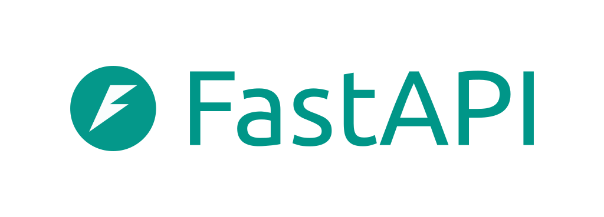

    
    <h1>Hawk: Debug & Profile</h1>
    
A lightweight debugging & profiling toolkit   for production 🐍 Python microservices

🦅 Hawk gives you more control over how your Python microservices run in production
with little overhead by bringing a set of internal API to help you to profile and debug your services.

> [!NOTE]
>
> 🚧 **This project is under active development and not ready for production use yet.** 🚧

Hawk is inspired by Go's `net/http/pprof` & `expvars` packages and 
OpenTelemetry Collector's ZPages which are in turn stemmed from Google's internal practices around
debugging production services.

> [!IMPORTANT]
>
> Be sure to start this project and wathch it if you find it helpful ⭐️

## Features

- ⏱️ **Memory Profiling** via the `tracemalloc` stdlib
- ⏱️ **CPU Profiling** (incl. Asyncio services) via `pyinstrument` & `cProfile` (soon)
- 🙋‍♀️ **Activate profiling on demand** in real environments
- 🎨 **Render your profiles** right from your browser
- ⬇️ **Download your profiles** for the further investigation
- 🔭 **Expose internal state** of your service via debug vars (🚧soon)
- 🔧 **Create custom debug pages** (a.k.a. `ZPages`) in a simplified way
- 🔧 **Controlled via environment variables**, no codebase modifications needed to enable/disable functionality completely
- 🔓 **No elevated permissions needed** (`CAP_PTRACE`, etc.)
- 🔭 **OpenTelemetry**-aware (🚧soon)

    
Integrated With:

    

        
        
        
    

