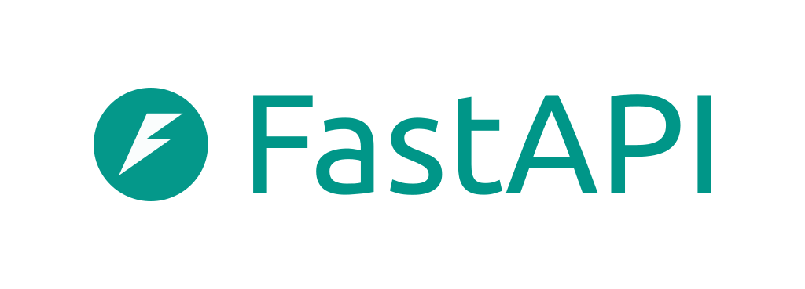

<div align="center">
    
</div>

# Hawk: Debug & Profile

A lightweight debugging & profiling toolkit for production 🐍 Python microservices.

Hawk is inspired by Go's `net/http/pprof` & `expvars` packages and 
OpenTelemetry Collector's ZPages which are in turn stemmed from Google's internal practices around
debugging production services.

<p align="center">Hawk plays well with your favorite frameworks:</p>
<div align="center">
    <a href="/integrations/fastapi/"></a>
    <a href="/integrations/starlette/"></a>
    <a href="/integrations/flask/"></a>
</div>

## Installation

Hawk is available on [PyPi](https://pypi.org/project/hawk-debug/), so you can install it as any other dependency:

```bash
pip install hawk-debug
```

It has no hard dependencies by default. You can pick what optional dependencies to install based on your needs:

```bash
pip install hawk-debug[pyinstrument] # if you plan to use PyInstrument for CPU profiling
```

## Why Hawk?

Hawk is a nimble toolkit that helps you to collect the missing context in order to troubleshoot the most obscure issues
and performance bottlenecks. 

It packs the best tools we have in our Python ecosystem to let you records information like 
[CPU (including asyncio-friendly) profiling](/profiling/cpu/), [memory allocations](/profiling/memory/), track thread activity right in your target environment
with minimal possible overhead when you specifically do profiling.

Hawk comes with [debug variables](/debug-variables/) that let's you expose any internal state of your application.
Other than that, you can build [your own custom ZPages](/zpages/) with information useful for your specific use-case.

Hawk would the least useful if you have a first-class observability platform at your disposal that supports
logs, distributed traces, metrics, and continuous profiling. Oh, and if you don't really care 
about the number of metrics you expose and use. 

Don't have that in place? That's alright, keep exporting Hawk, it should be helpful for you 🙌

## Features

- ⏱️ [Memory Profiling](/profiling/memory/)
- ⏱️ [CPU Profiling](/profiling/cpu/) (incl. Asyncio services)
- 🧵Thread activity tracking
- 🙋‍♀️ Activate profiling on demand in real environments
- 🎨 Render your profiles right from the browser
- ⬇️ Download your profiles for the further investigation
- 🔭 Expose internal state of your service via [debug vars](/debug-variables/), no external tools or services needed
- 🔧 Create [custom debug pages](/zpages/) in your services (a.k.a. ZPages) that both humans and scripts can work with
- 🔧 Controlled via environment variables, no code modifications needed to enable/disable functionality completely
- 🔓 No elevated permissions needed (`CAP_PTRACE`, etc.)

## License

Hawk is licensed under the Apache 2.0 License. See [LICENSE](https://github.com/roma-glushko/hawk) for more information.

Made with ❤️and ☕️ by [Roma Glushko](https://www.romaglushko.com/).
